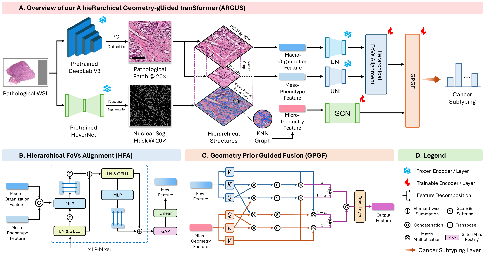

ARGUS
===========

Official code for **A Hierarchical Geometry-guided Transformer for Histological Subtyping of Primary Liver Cancer**.

> ARGUS (A hieRarchical Geometry-gUided tranSformer) captures macro-meso-micro hierarchical information within the tumor microenvironment for liver cancer histological subtyping.

## Overview



## Installation

```bash
pip install -r requirements.txt
```

## Preprocessing

1. Data preprocessing: [WSI_Segmenter](https://github.com/HaoyuCui/WSI_Segmenter). Also available in [./preprocess](./preprocess).

2. Extract raw patches to at least 1024x1024 resolution using [tiatoolbox](https://github.com/TissueImageAnalytics/tiatoolbox) or [DeepZoom](https://github.com/ncoudray/DeepPATH/blob/master/DeepPATH_code/00_preprocessing/0b_tileLoop_deepzoom6.py).

## Data preparation

1. Prepare data in the following structure (png/jpeg format):

    ```markdown
    ├── data
    │   ├── slide_1
    │   │   ├── patch_1.png
    │   │   ├── patch_2.png
    │   │   ├── ...
    │   ├── slide_2
    │   │   ├── ...
    │   └── slide_n
    │       └── ...
    ```

2. Create hierarchical patches:

    ```bash
    python ARGUS_utils/create_hi_patches.py --input <INPUT_DIR> --output <OUTPUT_DIR> --how non-blank
    ```
    
    `--how`: **center** (center-crop) or **non-blank** (selective-sampling)

3. Organize data like `example.csv` and create k-fold splits:

    ```bash
    python ARGUS_utils/gen_kfold_split.py --csv <CSV_PATH> --dir <STEP_2_OUTPUT_DIR> --k 5 --on patient
    ```
    
    `--on slide` | `--on patient` (use name column)

4. Download UNI weights from <a href="https://huggingface.co/MahmoodLab/UNI"></a> (`pytorch_model.bin`).

5. Modify [config.yaml](config.yaml):
    - **batch_size**, **lr**, **epochs**, **iters_to_val**, **save_best**
    - **freeze_ratio**, **cmb** (hierarchical FoV combinations: `s`, `m`, `l`, `sm`, `sl`, `ml`, `sml`), **UNI_path**
    - **class_names** (default: `['Fine', 'Small', 'Large']` for ICC subtyping)

## Train and evaluate

```bash
# Single fold
python train.py --fold 1

# All folds (Windows)
python ./scripts/train_kf.py

# All folds (Linux)
sh ./scripts/train_kf.sh
```

Results saved to `runs/{cmb}_{freeze_ratio}/{fold}/`.

## Model Architecture

ARGUS consists of three key components:

| Module | Full Name | Description |
|--------|-----------|-------------|
| **HFA** | Hierarchical FoVs Alignment | Bidirectional cross-attention fusion of multi-scale FoV features |
| **MGF** | Micro-level Geometric Feature | Nucleus-level geometric features via Hover-Net + GCN |
| **GPGF** | Geometry Prior Guided Fusion | Cross-modal transformer fusing morphological and geometric features |

## Comparison experiments

| Model | Authors | GitHub |
|-------|---------|--------|
| ABMIL | Ilse et al. | [https://github.com/AMLab-Amsterdam/attention_deep_mil](https://github.com/AMLab-Amsterdam/attention_deep_mil) |
| DSMIL | Li et al. | [https://github.com/binliangcs/DSMIL](https://github.com/binliangcs/DSMIL) |
| CLAM | Lu et al. | [https://github.com/mahmoodlab/CLAM](https://github.com/mahmoodlab/CLAM) |
| TransMIL | Shao et al. | [https://github.com/szc19990412/TransMIL](https://github.com/szc19990412/TransMIL) |
| Patch-GCN | Zhang et al. | [https://github.com/HanxunH/Patch-GCN](https://github.com/HanxunH/Patch-GCN) |

## License

© [IMIC](https://imic.nuist.edu.cn/) - GPLv3 License for non-commercial academic use.

## Reference

If you find ARGUS useful, please cite:

```bibtex
@INPROCEEDINGS{11357200,
  author={Lu, Anwen and Liu, Mingxin and Jiao, Yiping and Xu, Geyang and Gong, Hongyi and Cai, Chengfei and Chen, Jun and Xu, Jun},
  booktitle={2025 IEEE International Conference on Bioinformatics and Biomedicine (BIBM)}, 
  title={A Hierarchical Geometry-Guided Transformer for Histological Subtyping of Primary Liver Cancer}, 
  year={2025},
  volume={},
  number={},
  pages={3874-3877},
  keywords={Liver cancer;Pathology;Weak supervision;Tumor microenvironment;Liver;Morphology;Computer architecture;Transformers;Complexity theory;Tumors;Computational Pathology;Histological Subtyping;Weakly-Supervised Learning;Geometric Representation},
  doi={10.1109/BIBM66473.2025.11357200}}
```
